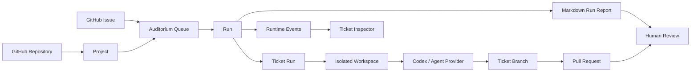

<p align="center">
	
</p>

<h1 align="center">Auditorium</h1>

Auditorium is a native, local-first macOS control plane for coding agents.

It turns a repository and an issue tracker into a visual queue of isolated agent runs:

```text
Connect GitHub -> choose a repo -> queue issues -> hit Play -> review pull requests and reports
```

The product is inspired by OpenAI Symphony's core idea: an issue tracker can become the operational control plane for coding agents. Each eligible ticket gets its own workspace, its own run state, its own logs, and a human-reviewable result.

Auditorium brings that model to a focused v0 GitHub-to-Codex PR control loop, with a companion Rust CLI named `symphony` for headless runs.

## Why This Exists

Coding agents are powerful, but the workflow around them is still too ad hoc.

Most teams already have the primitives they need:

- A repository with a real review process.
- An issue tracker with scoped units of work.
- A local machine or runtime that can safely execute changes.
- A human who needs to approve the final result.

Auditorium connects those pieces into one repeatable loop.

Instead of pasting issue text into an agent manually, tracking work in terminals, and reconstructing what happened afterward, Auditorium makes agent work inspectable:

- Which tickets are queued?
- Which workspace is running?
- Which agent handled it?
- What branch did it create?
- Did tests run?
- Was a pull request opened?
- What failed?
- What should the human do next?

The goal is not to auto-merge code. The goal is to make agent execution observable, reviewable, and safe enough to become part of a serious development workflow.

## Product Shape

Auditorium has two execution surfaces.

### Native macOS App

The Mac app is the visual orchestration surface:

- Project setup
- GitHub repository and issue source configuration
- Ticket browser
- Queue management
- Run detail
- Ticket inspector
- Runtime health
- Markdown reports
- Local persistence with SwiftData
- Secret storage with Keychain

### `symphony` CLI

The Rust CLI is the headless runner:

- Creates and validates `WORKFLOW.md`
- Checks local tools with `doctor`
- Runs GitHub issues from the terminal
- Creates deterministic workspaces
- Launches Codex for real runs
- Emits structured events
- Writes markdown reports

The CLI is designed to follow the service shape of OpenAI Symphony, adapted for Auditorium's local-first, GitHub-first v0.

## Current Status

Auditorium is in active v0 development.

Working today:

- Native macOS app project builds.
- SwiftUI shell, navigation, setup flow, queue, runs, reports, settings, and inspector screens exist.
- SwiftData models exist for projects, repositories, issue trackers, tickets, queues, runs, ticket runs, pull requests, events, reports, and provider accounts.
- Demo mode can seed a Burton Demo project with realistic tickets.
- Mock orchestration can create ticket runs, stream events, generate fake PR URLs, and produce markdown reports.
- Runtime detection checks Git, Codex CLI, and GitHub CLI.
- Provider protocols exist for source-code and issue-tracker adapters.
- GitHub OAuth device flow, repository listing, issue import, credential preflight, branch push, and pull request adapter coverage exist.
- The app coordinator can hand a queued GitHub issue to `symphony`, stream runtime events, persist the ticket run, and store the resulting pull request URL.
- `symphony` CLI can initialize workflows, run doctor checks, run mock issues, run queued issues, coordinate concurrent work, and perform the real GitHub/Codex issue-to-pull-request path.

Current trust level:

- Ready: demo flow, `symphony` CLI flow, app-to-CLI integration, and real GitHub smoke tests are implemented and test-backed.
- Needs final proof: Developer ID signing, notarization, Gatekeeper validation, clean-Mac launch, and a fresh credentialed manual pass on the signed artifact.
- Future: non-GitHub providers, hosted/team orchestration, and background automation beyond explicit user opt-in.

See [SPEC.md](SPEC.md) for the full product specification and [CHECKLIST.md](CHECKLIST.md) for the implementation tracker.

## v0 Scope

v0 is intentionally GitHub-only:

- GitHub repositories
- GitHub Issues
- GitHub OAuth
- Codex CLI as the primary agent
- Local Workspace as the real execution runtime
- Local SwiftData persistence
- Keychain-backed credentials
- Markdown reports

Future adapters should plug into the same provider boundaries:

- Linear
- GitLab
- Bitbucket
- Azure DevOps
- Azure Boards
- Generic Git remotes
- Generic shell-command agents
- Local workspace runtime

## Architecture



## Stack

The macOS app uses:

- Swift
- SwiftUI
- SwiftData
- Swift Concurrency
- Observation with `@Observable`
- AppKit only where macOS integration needs it
- Keychain for secrets
- macOS 15+ deployment target

The CLI uses:

- Rust
- Tokio
- Clap
- Serde
- GitHub CLI for GitHub operations
- Codex CLI for agent execution

## Repository Layout

```text
.
├── Auditorium.xcworkspace/
├── Package.swift
├── Auditorium/
│   ├── Auditorium.xcodeproj/
│   ├── Auditorium/
│   │   ├── App/
│   │   ├── Core/
│   │   ├── DesignSystem/
│   │   └── Features/
│   ├── AuditoriumTests/
│   └── AuditoriumUITests/
├── Tests/
│   └── AuditoriumCoreTests/
├── symphony/
│   └── src/
├── SPEC.md
├── CHECKLIST.md
├── Cargo.toml
└── README.md
```

Important app areas:

- `Auditorium/Auditorium/Core/Models`: SwiftData records and normalized domain enums.
- `Auditorium/Auditorium/Core/Providers`: provider protocols, auth descriptors, mocks, and placeholders.
- `Auditorium/Auditorium/Core/Orchestration`: queue service, demo data, and orchestrator.
- `Auditorium/Auditorium/Core/Runtime`: local runtime/tool detection.
- `Auditorium/Auditorium/Core/Reports`: markdown report generation.
- `Auditorium/Auditorium/Features`: SwiftUI screens.
- `symphony/src`: Rust CLI implementation.

## Requirements

For the macOS app:

- macOS 15+
- Xcode 17+ recommended for the current project
- Git

For `symphony`:

- Rust stable
- Git
- GitHub CLI (`gh`)
- Codex CLI for real agent execution

Demo mode does not require network access, GitHub credentials, or Codex.

## Quick Start: macOS App

Clone the repository:

```sh
git clone https://github.com/charliewilco/Auditorium.git
cd Auditorium
```

Build and launch the app from the command line:

```sh
./script/build_and_run.sh --verify
```

Open the Xcode workspace:

```sh
open Auditorium.xcworkspace
```

Build the package core:

```sh
swift build
```

Run package tests:

```sh
swift test
```

Build the native app target from the command line:

```sh
xcodebuild build \
	-workspace Auditorium.xcworkspace \
	-scheme Auditorium \
	-configuration Debug \
	-destination 'platform=macOS,arch=arm64' \
	CODE_SIGNING_ALLOWED=NO
```

Package a downloadable app zip:

```sh
./script/package_release.sh --unsigned
```

The zip contains `Auditorium.app` and a bundled `symphony` CLI at `Auditorium.app/Contents/Resources/bin/symphony`, so the app does not require a separately installed `symphony` binary on another Mac. Real GitHub/Codex runs still require Git, GitHub CLI, Codex CLI, and GitHub credentials on that machine.

The unsigned zip is useful for CI smoke artifacts. For a clean Mac distribution build, use Developer ID signing and notarization:

```sh
./script/package_release.sh --developer-id --notarize
```

Developer ID packaging requires Apple signing credentials locally or in CI. See [docs/RELEASE.md](docs/RELEASE.md).

Run the Xcode app test bundle when you need app-integration coverage:

```sh
xcodebuild test \
	-workspace Auditorium.xcworkspace \
	-scheme Auditorium \
	-configuration Debug \
	-destination 'platform=macOS,arch=arm64' \
	CODE_SIGNING_ALLOWED=NO
```

## Usage Guide: App

### 1. Launch Auditorium

Run the app with `./script/build_and_run.sh`, the Codex Run action, or Xcode. On first launch, the app opens to the Welcome screen.

### 2. Open Demo Project

Use **Open Demo Project** to seed the local Burton Demo project:

- Repository: `charlie/burton-ios`
- Issue source: GitHub Issues shape, demo-backed
- Runtime: Mock Runtime
- Agent: Mock Agent

The demo project is offline and deterministic.

### 2b. Create A GitHub Project

For the real v0 path, configure a GitHub OAuth client ID in Settings or the setup wizard, complete the GitHub browser approval, choose an accessible repository, and import open issues.

### 3. Browse Tickets

Open **Tickets** to inspect the seeded issues. Tickets include status, priority, labels, complexity, and update metadata.

### 4. Add Tickets To The Queue

Select tickets and add them to the queue. Queue items are persisted locally and can be reordered, enabled, disabled, removed, or cleared.

### 5. Run The Queue

Open **Queue** and press **Run Queue**.

In real GitHub mode, Auditorium uses the stored GitHub credential, prepares a local workspace, runs `symphony`, streams events, and records the resulting branch, pull request, report, and inspector timeline.

In demo mode, Auditorium will:

- Create a `RunRecord`
- Create one `TicketRunRecord` for each enabled queue item
- Prepare deterministic workspace paths
- Emit runtime and agent events
- Simulate implementation, tests, failures, blocked states, and pull requests
- Persist all state in SwiftData
- Generate a markdown report

### 6. Inspect A Ticket

Use the ticket inspector to review:

- Ticket metadata
- Queue state
- Latest run status
- Workspace path
- Runtime status
- Agent status
- Branch name
- Pull request URL
- Timeline events
- Failure reason
- Suggested next action

### 7. Review Reports

Open **Reports** to preview generated markdown reports. Reports are intended to be human-review artifacts, not incidental logs.

## Quick Start: `symphony` CLI

Build and test the CLI:

```sh
cargo test --all-targets
```

Create a workflow:

```sh
cargo run -p symphony -- init
```

Check local tooling:

```sh
cargo run -p symphony -- doctor --json
```

Run an offline mock issue:

```sh
cargo run -p symphony -- run \
	--repo charlie/burton-ios \
	--issue 101 \
	--mock \
	--json
```

Run a dry-run against a real GitHub issue:

```sh
cargo run -p symphony -- run \
	--repo OWNER/REPO \
	--issue 123 \
	--dry-run \
	--json
```

Run a real issue path:

```sh
cargo run -p symphony -- run \
	--repo OWNER/REPO \
	--issue 123 \
	--json
```

For real runs, make sure:

- `gh auth status` succeeds.
- `codex --version` succeeds.
- The target repository is accessible.
- The working policy in `WORKFLOW.md` is appropriate for the repository.

### `symphony` Command Contract

Every `symphony` command supports `--help` through Clap-generated help text. The v0 commands are:

- `symphony init`
- `symphony doctor`
- `symphony run`
- `symphony run-queue`
- `symphony daemon`
- `symphony report`

The CLI writes human-oriented status to stderr unless `--json` is supported and enabled. JSON run mode emits newline-delimited JSON events followed by a final JSON report payload. Queue JSON mode emits queue events, per-ticket report payloads, and typed coordination messages.

`symphony run-queue --repo OWNER/NAME --issues 1,4,7 --workflow WORKFLOW.md --workspace-root .auditorium/workspaces --json` runs multiple issues through one queue-level orchestration. It enforces `agent.max_concurrent_agents`, writes an append-only coordination journal to `<workspace-root>/coordination/<run-id>.jsonl`, and injects bounded related-work summaries into later agent prompts at launch time.

`symphony daemon` runs one scheduling tick by default. Use `--watch` to keep the daemon alive and reload `WORKFLOW.md` before each tick. `--max-ticks` and `--poll-interval-ms` make watch mode deterministic for smoke tests and local validation.

When a project handoff file exists at `<workspace.root>/projects/<project-id>/project-state.json`, `symphony daemon --project <project-id>` reads it, polls GitHub issues for the configured repository with `gh issue list`, applies workflow concurrency/retry policy, emits the scheduler plan in JSON mode, and writes the latest plan to `last-scheduler-plan.json` beside the handoff file. If the handoff file sets `execute_dispatches` to `true`, the daemon runs selected dispatches through `symphony run`, writes intermediate and terminal run state back to `project-state.json`, and stores retry backoff ticks after dispatch failures. While a dispatch is running, `not_before_tick` is the daemon deadline; a later tick at or past that value reconciles stale running state into a failed, retryable run.

Exit behavior is stable by error class:

- `20`: missing workflow file.
- `21`: malformed workflow front matter.
- `22`: invalid workflow/configuration or failed `doctor` preflight.
- `30`: child command failed, including Git, GitHub CLI, validation, or Codex.
- `40`: filesystem or process I/O failure.
- `41`: JSON serialization/deserialization failure.

## `WORKFLOW.md`

Auditorium projects and the CLI both use a workflow policy concept. The default policy describes concurrency, retry behavior, branch naming, testing, pull request creation, and agent instructions.

Create one with:

```sh
cargo run -p symphony -- init
```

The generated file includes YAML front matter plus an agent prompt template. The CLI reads this file before a run. The Mac app stores the project workflow policy in SwiftData and will eventually sync it into the runtime handoff path.

## Local Data And Filesystem

The app is local-first.

SwiftData stores durable records such as projects, tickets, queue items, runs, ticket runs, pull requests, runtime events, reports, and provider account metadata.

Secret material belongs in Keychain, not SwiftData.

Application workspace files live under:

```text
~/Library/Application Support/Auditorium/
```

The intended project layout is:

```text
~/Library/Application Support/Auditorium/
└── Projects/
    └── <project-id>/
        ├── Repositories/
        ├── Workspaces/
        ├── Logs/
        └── Reports/
```

Workspace paths are deterministic and sanitize ticket identifiers for filesystem safety.

Local workspace runtime reuse policy:

- Each ticket maps to one deterministic workspace path under the project `Workspaces/` directory.
- Preparing a local runtime workspace calls the source provider's `cloneOrUpdate` operation for that path, so an existing workspace is updated in place instead of silently discarded.
- Preparing a workspace creates or checks out the deterministic ticket branch through the source provider before agent execution starts.
- Terminal and canceled workspaces are retained for inspection in v0. Automated cleanup should be added only behind an explicit user action or documented retention setting.

## Security Model

Auditorium should be safe by default:

- Secrets are stored in Keychain.
- SwiftData stores only provider metadata.
- Demo mode requires no network.
- Real runs should preflight runtime and agent availability before creating workspaces.
- The app should never force-push or auto-merge without explicit policy.
- Reports should not include tokens, credentials, or private auth state.

## Provider Model

Auditorium keeps integrations behind protocols so future sources can be added without rewriting queue, run, report, or inspector UI.

The v0 provider pair is:

```swift
final class GitHubRepositoryProvider: SourceCodeProvider {}
final class GitHubIssueTrackerProvider: IssueTrackerProvider {}
```

Future examples:

```swift
final class LinearIssueTrackerProvider: IssueTrackerProvider {}
final class GitLabRepositoryProvider: SourceCodeProvider {}
final class AzureBoardsIssueTrackerProvider: IssueTrackerProvider {}
```

Provider implementations normalize external payloads into Auditorium descriptors before orchestration sees them.

## Development Commands

Format Rust:

```sh
cargo fmt --all
```

Check Rust formatting:

```sh
cargo fmt --all --check
```

Test Rust:

```sh
cargo test --all-targets
```

Build Swift package core:

```sh
swift build
```

Test Swift package core:

```sh
swift test
```

Build macOS app smoke target:

```sh
xcodebuild build \
	-workspace Auditorium.xcworkspace \
	-scheme Auditorium \
	-configuration Debug \
	-destination 'platform=macOS,arch=arm64' \
	CODE_SIGNING_ALLOWED=NO
```

Test macOS app integration target:

```sh
xcodebuild test \
	-workspace Auditorium.xcworkspace \
	-scheme Auditorium \
	-configuration Debug \
	-destination 'platform=macOS,arch=arm64' \
	CODE_SIGNING_ALLOWED=NO
```

Build macOS app release smoke target:

```sh
xcodebuild build \
	-workspace Auditorium.xcworkspace \
	-scheme Auditorium \
	-configuration Release \
	-destination 'platform=macOS,arch=arm64' \
	CODE_SIGNING_ALLOWED=NO
```

Package macOS app artifact:

```sh
./script/package_release.sh --unsigned
```

Run all local checks:

```sh
swift build
swift test
cargo fmt --all --check
cargo test --all-targets
xcodebuild build -workspace Auditorium.xcworkspace -scheme Auditorium -configuration Debug -destination 'platform=macOS,arch=arm64' CODE_SIGNING_ALLOWED=NO
xcodebuild build -workspace Auditorium.xcworkspace -scheme Auditorium -configuration Release -destination 'platform=macOS,arch=arm64' CODE_SIGNING_ALLOWED=NO
```

Release signing and notarization policy lives in [docs/RELEASE.md](docs/RELEASE.md).

## Contributing Direction

The next useful implementation slices are:

1. Produce and verify a Developer ID signed, notarized app on a clean Mac.
2. Complete a fresh credentialed manual acceptance pass on that signed artifact.
3. Keep moving app logic into SwiftPM packages so core behavior stays fast to build and test.
4. Extend the control plane in order: daemon handoff, coordination UI, generic CLI agent UX, then the first non-GitHub issue adapter.

Keep the product small and observable. The best v0 is not a general agent platform; it is a trustworthy GitHub issue-to-pull-request loop with excellent local inspection.

## License

MIT
